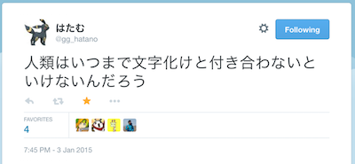

```{r child = "document_setting.Rmd"}
```

---

\center{
  \Huge{\textbf{\textcolor{magenta}{Tokyo.R} \\シリーズ前処理: \\おさらい}}
}

---

## \faFood 前処理

\center{
  \LARGE{【広義】手元にある観測データを、意図する分析手法が適用できる形にまでもっていく方法}
}

> \scriptsize{\faLink http://www.slideshare.net/dichika/maeshori-missing}

## \faFood 前処理

```{r work_time_ratio, fig.width = 6, fig.height = 3.2}
data.frame(
  time = c("Manipulation", "Analysis"),
  effort    = c(80, 20)) %>%
  ggplot(., aes(x = "", y = effort, fill = time)) +
  geom_bar(width = 1, stat = "identity") +
  coord_polar("y", start = pi / 3) +
  theme(text = element_text(family = "Helvetica", size = 14))
```

\scriptsize{\faBook Dasu and Johnson 2003. Exploratory Data Mining and Data Cleaning. \textit{Wiley}}

## \faFood 前処理

\center{
  \Huge{\faTime 解析時間の\\ほとんどは前処理}
}

---

```{r, results = 'asis', size = 'scriptsize'}
rep("ムダ", 100)
```

---

\center{
  \fontsize{120}{10}{\faThumbsDown \faThumbsDown \faThumbsDown}
}

---

\center{
  \large{（データ処理が楽に終ることで得られる）\\\textcolor{magenta}{幸せ}について\\本気だして考えてみた}
}

---

\center{
  \Huge{\textbf{今日のテーマ: \\\textcolor{Blue1}{前}処理のための\\\textcolor{magenta}{前}処理}}
}

---

## \large{もちべーしょん: 前処理の苦労を減らしたい}

* データ解析や前処理をする際の用意、心がけ
* ぼくのがんがえた~~さいきょうの~~こうりつてきな**まえしょり**にひつような**まえしょり**

## 良い前処理を実現するための５箇条

1. RStudio内ですべて完結
2. `.Rproj`を作成する
3. GitやSubversionによるバージョン管理をおこなう
4. `.Rmd`でファイルを保存する
5. プロジェクトのガイドラインを策定する

---

\center{
  \large{「いろいろと\textcolor{Blue2}{面倒}だ」}
  
  \huge{「でもあなたのちっぽけな\textbf{\textcolor{magenta}{頭では忘れてしまう}}でしょう（煽り）」}\
  
  \small{「ぐぬぬ」}
}

---

## 何が目的か

数時間ですべての作業が完了するプロジェクトはほとんどなく、多くのプロジェクトが長い時間を経て完成される。また、完成されてからも定期・不定記に管理する必要が生じる。そのため、プロジェクトは変動しつづけるものである。

-> 記録として残すことが大事

## dd

* 以下の項目を円滑に進める体制が整っている
* オープンなプロジェクトであればGitHubにリポジトリを作成する
* し、コードとコメントの分離に努める
* し、プロジェクト内での混乱、衝突を防ぐ

## Packrat...

```{r}
library(DiagrammeR)
```

## @dichika進捗どうですか\faEyeOpen

\includegraphics[angle = -3]{images/at_dichika.png}

## \large{Remember \textit{\textcolor{Black1}{why are you using SJIS}}}


> \scriptsize{\faLink https://github.com/hadley/dplyr/issues/339}

## \#Tsurami


> \scriptsize{\faLink https://twitter.com/yamano357/status/552514988137783301}

## \#Tsurami



> \scriptsize{\faLink https://twitter.com/gg$\_$hatano/status/551328451068588032}


## \#Tsurami

\center{
  \Huge{供養しましょう}
  \small{\url{https://github.com/uribo/data_treatment}}
}

---


## 前処理のための前処理チェックリスト


## Abstract

元データの単位変換や新たな値を算出するといった前処理の作業は、データ解析の大部分を占める作業である。一方で前処理の作業は、データを整形する、項目名を修正する、新たな項目を追加するというように、決まったパターンであることが多いため、Rによる自動的な処理が可能である。本発表では実際のデータ解析前処理において、多くの作業時間を費やすことになりがちな前処理を効率的に行うためのツールや前段階として用意しておくとよいと考えられる項目を紹介する。

## \small{Sessioninfo: `r R.Version()$version.string`}

```{r size = 'footnotesize'}
sessionInfo() %$% otherPkgs %>% names
```